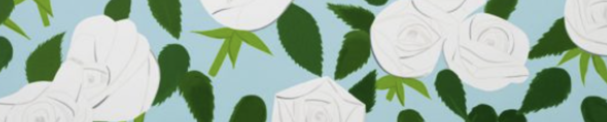

---
# Feel free to add content and custom Front Matter to this file.
# To modify the layout, see https://jekyllrb.com/docs/themes/#overriding-theme-defaults

layout: default
---

  

    <b class="section-title">About Us</b>
    

    We study the ecology and evolution of plant–pathogen interactions, focusing primarily on <em>Arabidopsis thaliana</em> and the bacteria that reside within it. Our approach is interdisciplinary; we draw upon tools from molecular genetics, molecular evolution, computation, field biology, chemistry, and population genetics to understand how ecological interactions shape evolutionary dynamics. Many of our field experiments are performed in the Midwest, or abroad, at sites in Sweden and France.
    

  

    
    

      Microbial Interactions
    

  

  

    
    

      NLR Evolution
    

  

  

    
    

      Co-evolutionary Interactions
    

  

  <b>
    
      
        <a href="{{ page.url | relative_url }}">News</a>
      
    
  </b>
  <ul>
    
      <li>
        <a href="{{ post.url | relative_url }}">{{ post.title }}</a>
        
{{ post.date | date: "%B %d, %Y" }}

        
{{ post.excerpt }}

      </li>
    
  </ul>

