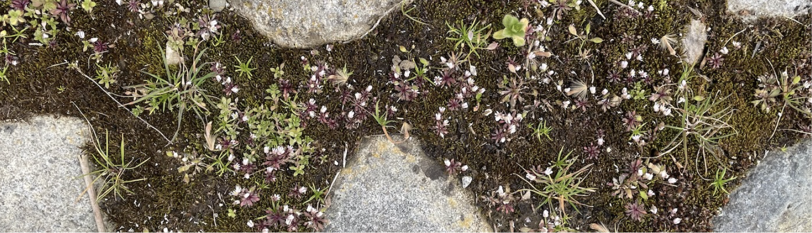
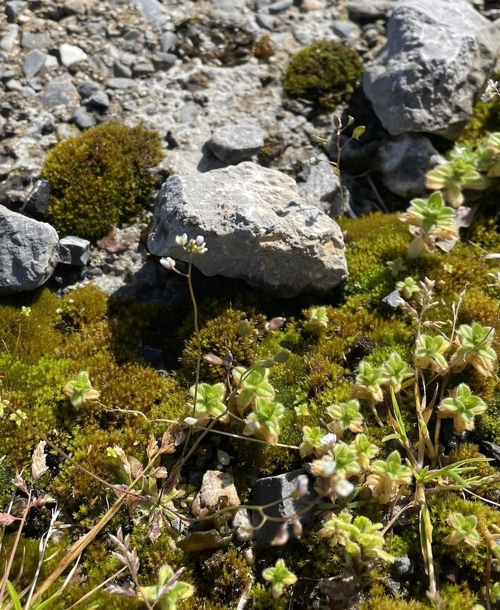
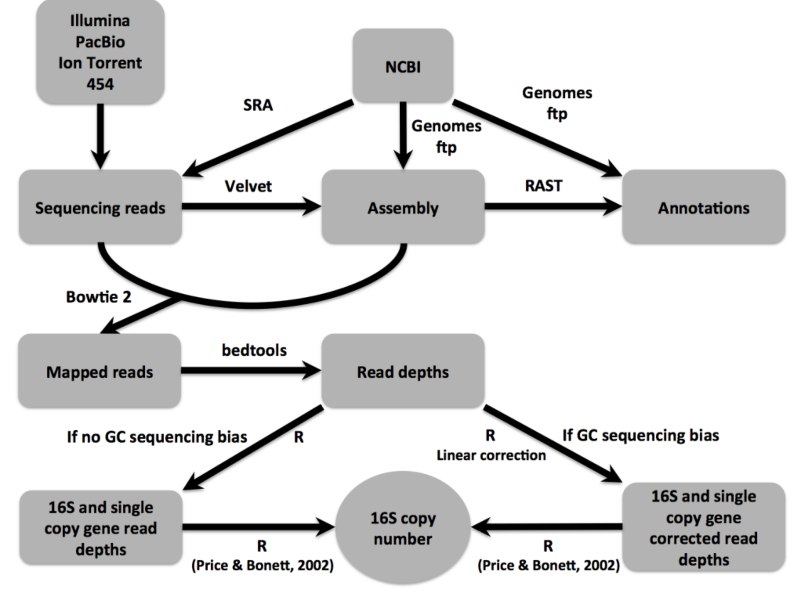

  
  
NLR Evolution in <em>A. thaliana</em> and its Relatives

    
The evolution of NLR resistance genes in <em>Arabidopsis thaliana</em> and its relatives reflects adaptation to microbial threats, with these resistance genes key to detecting pathogen effectors and triggering immunity. We investigate the ecological, genomic, and functional drivers of resistance gene evolution by studying NLR-effector interactions across hosts and populations.

    

        
    

    

    

      The NLR genes in <em>A. thaliana</em> exhibit a range of evolutionary histories, from ancient balanced polymorphisms through neutrality to selective sweeps. Since many of the pathogens that attack <em>A. thaliana</em> are generalists, and both the microbiota and pathobiota of <em>Arabidopsis</em> are shared with related and co-occurring hosts, we are interested in the extent to which molecular evolutionary dynamics of resistance play out at the community level. In particular, we ask: can we see evidence of congruent molecular evolution at orthologous NLR resistance genes across <em>A. thaliana</em>, <em>Cardamine hirsuta</em>, and <em>Erophila verna</em>? We are further interested in the extent of functional conservation of orthologous NLR’s among these hosts, especially in whether the repertoires of recognized effectors diverge and whether they are similarly integrated within the broader NLR immune signaling network. This effort focuses on natural populations in which these three hosts co-occur across a metapopulation in the Midi-Pyrénées region of southern France. This project allows a dual focus on both the importance of ecological context on the evolution of resistance genes and on the evolution of the immune system itself. 
    

    

    

  
<b>Selected Publications:</b>

  <ul>
    <li>Maerkle, H and J Bergelson. Evolutionary implications of host interactions with a generalist pathogen. In review.</li>
    <li>Weiner, B, Maerkle, H, Laderman, E, Demirjian, C and J Bergelson. 2025. A physical model links structure and function in the plant immune system. <i>PNAS</i>, in press.</li>
    <li>Karasov, TL, Kniskern, JM, Gao, L, DeYoung, BJ, Ding, J, Ullrich, D, Lastra, R, Nallu, S, Innes, RW, Barrett, LG, Hudson, RR and J Bergelson. 2014. The long-term maintenance of a resistance polymorphism through diffuse interactions. <i>Nature</i> 512 (7515): 436–440.</li>
  </ul>

 

<h3>16Stimator</h3>

  
  

    

      Generate 16S rRNA gene (16S) copy number estimates for bacterial genomes based on comparison of sequencing read depths of ribosomal and single copy gene regions. The method is published in: Perisin et al. 2015. Unfortunately, the publication is not open access (please e-mail to retrieve a copy) but the <a href="https://bitbucket.org/perisin/16stimator/src/master/">code of 16Stimator is freely available</a>.
    

  

