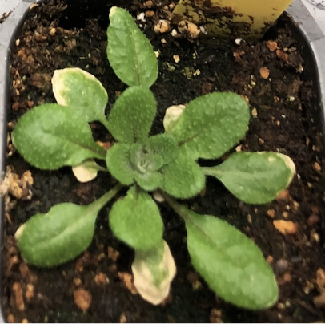

NLR Evolution

    
The evolution of NLR (nucleotide-binding leucine-rich repeat) genes in Arabidopsis thaliana and its relatives represents a dynamic and complex adaptation to microbial pressures. These genes, including well-studied resistance (R) genes such as RPS5, RPS2, RPM1, and RPP8, play a central role in plant immunity. They recognize specific pathogen effectors and initiate defense responses that shape the composition and structure of associated microbial communities. The leucine-rich repeat (LRR) domains of many NLRs exhibit high polymorphism, which allows plants to detect a wide array of microbial signals. However, not all NLRs evolve similarly. Some follow presence/absence polymorphism patterns and show lower LRR variation, suggesting multiple evolutionary strategies are at play.

    

        
    

    

    <b>NLR Evolution in A. thaliana and its Relatives</b>
    

Our understanding of how polymorphism is maintained in plant immune genes has largely relied on models of pairwise interactions, but many pathogens infect multiple hosts, suggesting the potential for convergent evolution across plant species. This project investigates R gene evolution in Arabidopsis thaliana and co-occurring Brassicaceous species using R-gene enrichment sequencing, ecological and functional assays, and comparative genomics. We explore how shared pathogens, trade-offs, and genomic constraints shape immune gene dynamics, revealing a balance between growth and defense. High NLR diversity, expression variability, and structural complexity—especially in duplicated loci—highlight the challenges of studying these genes, which we address with advanced sequencing methods. Ultimately, we aim to map R gene evolution and understand how processes like gene duplication and conversion contribute to a flexible, co-evolving plant immune system.

    

    <ul>
        <li>MacQueen et al., Population genetics of the highly polymorphic RPP8 gene family, Genes 10(9), 691 (2019), doi:10.3390/genes10090691</li>
        <li>Shen et al., Unique evolutionary mechanism in R-genes under the presence/absence polymorphism in Arabidopsis thaliana, Genetics 172, 1243–1250 (2006), doi:10.1534/genetics.105.047290</li>
        <li>Karasov et al., The long-term maintenance of a resistance polymorphism through diffuse interactions, Nature 512(7515), 436–440 (2014), doi:10.1038/nature13439</li>
    </ul>
    

