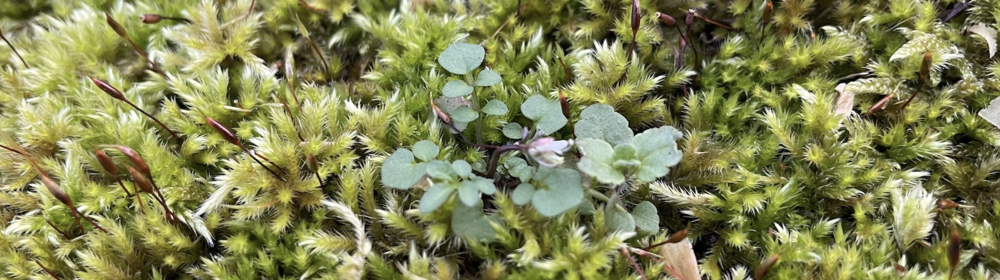

  
  
Coevolutionary interactions

    
Coevolutionary interactions between plants and their microbial communities offer a more nuanced understanding of immune system evolution than the traditional “arms race” model. Traditional models of plant-pathogen dynamics often emphasize an "arms race" scenario, with a continuous back-and-forth of new defenses and counter-defenses. However, coevolutionary interactions between plants and their microbial communities present a more nuanced view. Rather than such a rapid cycle, resistance (R) genes, particularly those encoding NLRs, are shaped by frequency-dependent selection. Our research has shown that plant-pathogen relationships often operate within diffuse interaction networks, where multiple plant genotypes and microbial strains influence evolutionary outcomes.This broader understanding challenges the notion of a simple conflict between host and pathogen, recognizing instead that hosts are frequently exposed to multiple pathogens, leading to co-infections by different strains or species.

    

        
    

    

    <b>Coevolutionary Interactions</b>
    
Coevolution between plants and microbes is a complex, context-dependent process shaped by factors such as climate history, R-gene expression variability, and reciprocal adaptation between hosts and their microbiomes. Gene families like RPP8 illustrate how duplication and conversion generate immune diversity in response to dynamic microbial environments. The hologenome concept further suggests that host and microbiome genomes function as a single evolutionary unit, or holobiont, though this idea remains controversial and demands rigorous testing. Ultimately, these interactions influence not only disease resistance but also overall plant performance and microbial community structure, revealing how ecological and evolutionary networks drive the coevolution of plant immunity.
    

    

  

