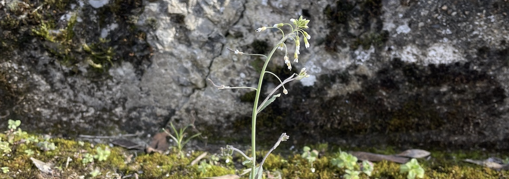
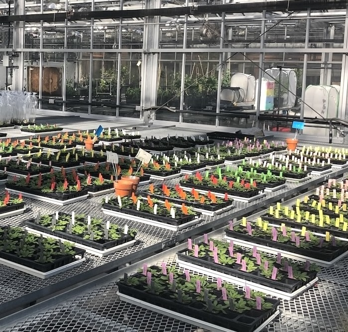

  
  
Coevolutionary Interactions

    
We investigate how host-microbiome interactions influence pathogen dynamics, seasonal processes shaping the <em>Arabidopsis</em> microbiome, and microbiome-based approaches to improve plant health. Despite pathogens' evolutionary advantages, plants often resist infection in nature, partly due to long-maintained polymorphisms in resistance (R) genes. Our goal is to uncover genetic factors affecting complex traits like disease by considering both host and pathogen contributions.

    

        
    

    

    
Our research investigates how host genetics, microbial communities, and environmental factors interact to shape plant immunity and pathogen success. We focus on microbial cooperation and competition, the genetic basis of pathogen-pathogen interactions, and the community context—including generalist microbes and alternative hosts—that maintains immune diversity. Seasonal and geographic variation, along with host and microbiota genetic diversity, influence these dynamics. By studying large isolate collections from pathogenic and commensal bacteria, we aim to uncover the ecological and genetic principles that enable pathogen invasion and identify key genes from both host and microbe that govern these interactions. Framed within the hologenome concept—which treats the host and microbiome as a unit of selection—we explore how coevolution shapes immune diversity, plant performance, and microbial community structure in complex and reciprocal ways.
    

    

  

