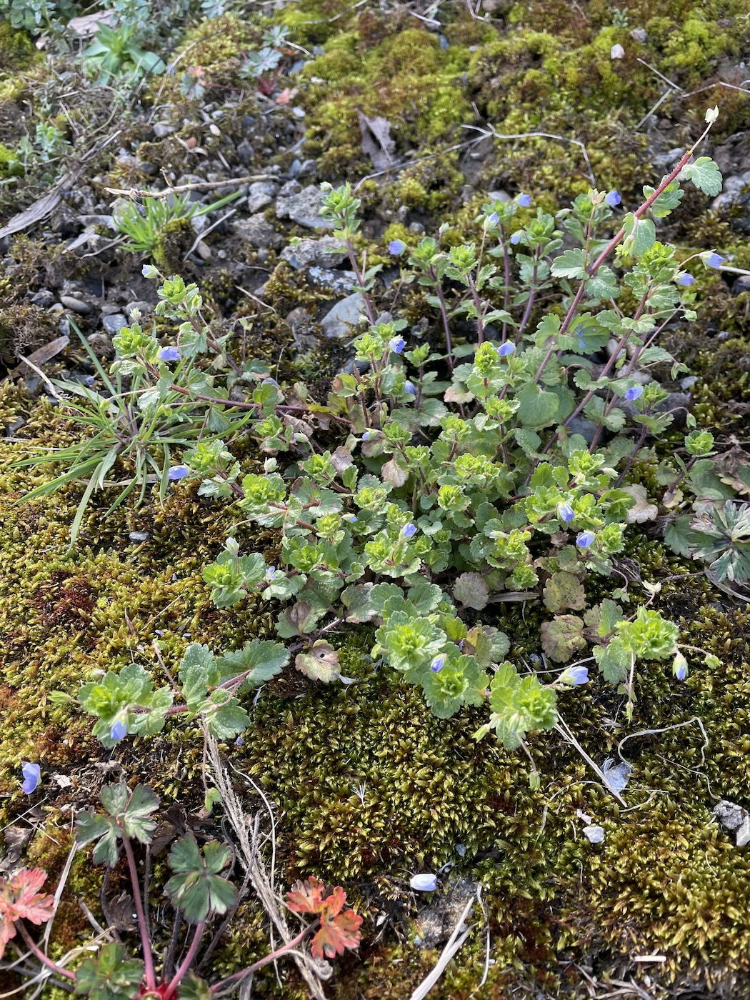
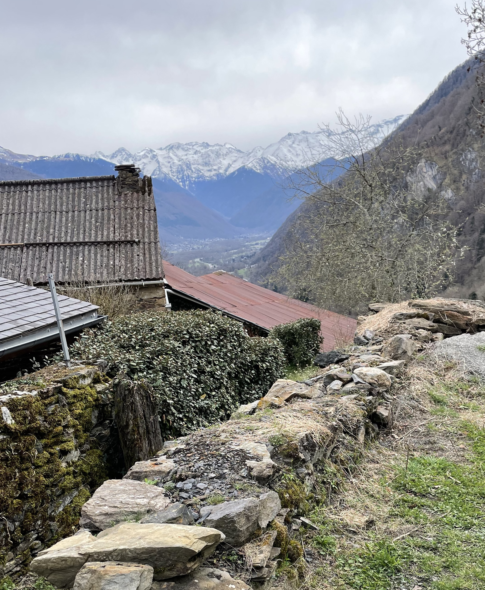

  
  
Microbial Interactions & Communities

    
Plants harbor diverse microbial communities that influence host health, development, fitness, and disease resistance. These plant–microbe interactions are dynamic, influenced by environmental factors, and mediated by host genetics, which can favor or suppress particular microbial taxa. Variation in resistance alleles across genotypes suggests frequency-dependent selection and an adaptive strategy for maintaining microbial balance. To understand the ecological roles and evolutionary histories of these plants, we must understand what these microbes are and how they colonize and interact with plant tissues and with each other.

    

        
    

    

    <b>Microbial Interactions & Communities</b>
    
Microbial community structure differs between plant tissues and environments, influenced by the microorganisms living in and on leaves (the phyllosphere) and roots (the rhizosphere). Key microbial “hubs” affected by host genetics play outsized roles in community assembly. Understanding how host genes structure these interactions can reveal mechanisms that promote beneficial microbes and limit pathogen invasion.
Although patterns of association can provide insights into microbial ecology, mechanistic understanding requires experimentation. We are cultivating microbes associated with Arabidopsis thaliana populations collected from Sweden, France, and North America, and thousands of bacterial and fungal OTUs have already been identified within plant tissues. In parallel, we investigate species interactions to better understand how host genotype influences community structure. Ultimately, our research aims to enhance plant resistance by identifying conditions and host traits that foster beneficial microbial communities.
    

    

