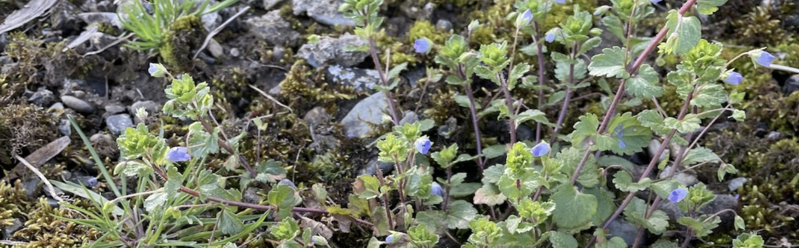

  
  
Microbial Interactions & Communities

    
Plants harbor diverse microbial communities that influence health, development, and disease resistance—shaped by host genetics, environment, and microbe–microbe interactions. To uncover the genetic and ecological mechanisms driving these dynamics, we study how microbes colonize and interact with plant tissues using <em>Arabidopsis thaliana</em> and rice as models.

    

        
    

    

    <b>Microbial Interactions & Communities</b>
    
In <em>A. thaliana</em>, we cultivate and characterize microbes from natural populations in Sweden, France, and North America, using genome-wide association studies (GWAS), multi-year fieldwork, and culturing to identify host loci influencing microbiome composition and plant fitness. In rice, we integrate multi-omics data and machine learning to dissect the genetic basis of root microbiome variation across varieties. Across systems, we focus on microbial “hub” species whose colonization and interactions are strongly shaped by host genotype, and we use controlled experiments to test the function of candidate genes and host traits in structuring microbial communities. Ultimately, our work aims to reveal how plants promote beneficial microbes, limit pathogens, and enhance resistance..
    

    

